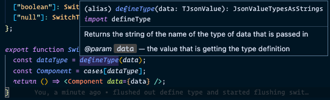

JSDoc + Typescript make for the coolest tool tips in VScode. Below is a screenshot of a tool tip for a function that I wrote that explains perfectly what the function is and what it does. I'll never have to look back at that function to remember how use it.



By typing out the params and return type in Typescript you get the type safety from the TS compiler, but you also the type definitions in the tool tips ( ahhhmazing 😄 ). Combine that with a short description about what the function does or how to use the function and you have a beautiful well documented function with very little work.

Here is an example of my Typescript + JSDoc function that produced the above tool tip.

```ts
/**
 * Returns the string of the name of the type of data that is passed in
 * @param data the value that is getting the type definition
 */

export function defineType(data: TJsonValue): JsonValueTypesAsStrings {
  const primitive = typeof data

  if (Array.isArray(data)) {
    return 'array'
  }
  if (data == null) {
    return 'null'
  }

  if (primitive == 'function') {
    throw new TypeError('not a valid json type sorry')
  }
  if (primitive == 'symbol') {
    throw new TypeError('not a valid json type sorry')
  }
  if (primitive == 'bigint') {
    throw new TypeError('not a valid json type sorry')
  }
  if (primitive == 'undefined') {
    throw new TypeError('no value was given')
  }

  return primitive
}
```
