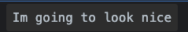

You can easily style console.logs by adding `%c` at the beginning of your log, and then add a second parameter to the log function that is a string containing the css styles

```js
console.log(
  `%cIm going to look nice`,
  `font-size:20px; background:#333; border-radius:4px;padding:10px;`
)
```


